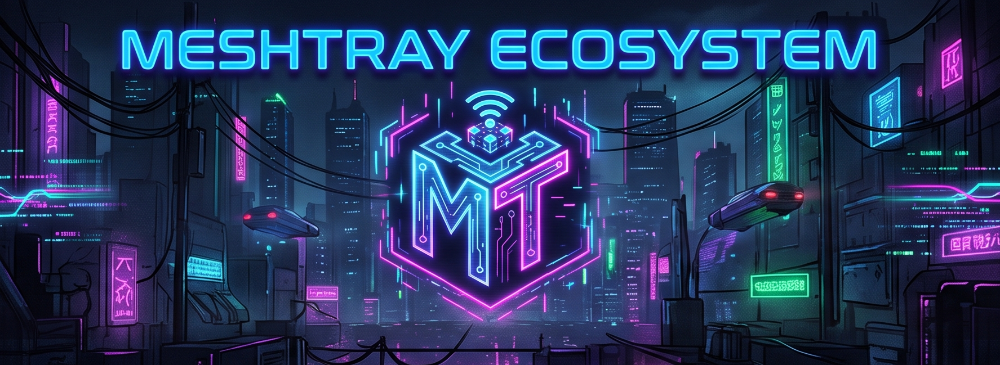
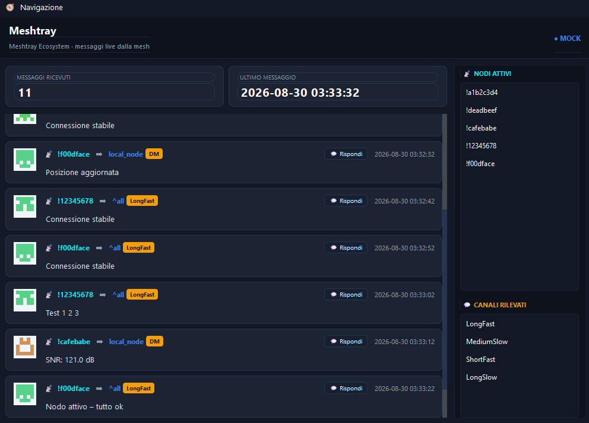
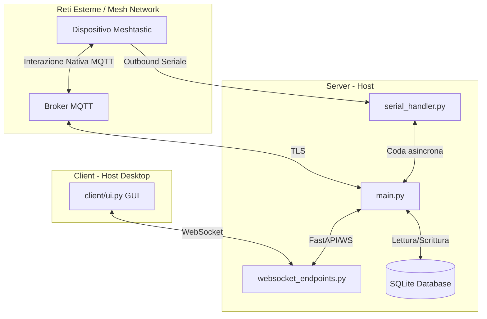

# Meshtray Ecosystem

[](https://www.python.org/)
[](https://www.riverbankcomputing.com/software/pyqt/)
[](https://fastapi.tiangolo.com)
[](https://meshtastic.org/)
[](https://www.gnu.org/licenses/gpl-3.0)



> [!WARNING]
> ### ⚠️ Progetto Non Ufficiale (Unofficial Project)
> Questo software è un progetto comunitario indipendente **totalmente non ufficiale** e non è in alcun modo affiliato, associato, sponsorizzato o approvato da Meshtastic LLC. Meshtastic® è un marchio registrato di Meshtastic LLC.

Questo progetto è una soluzione integrata per connettere la rete mesh **Meshtastic** a un broker **MQTT**, consentendo la traduzione dei messaggi in entrambe le direzioni (Mesh <-> MQTT), il salvataggio dei messaggi in un database locale SQLite, e la notifica in tempo reale tramite WebSocket a un'applicazione client Desktop con interfaccia grafica (GUI).



---

## Architettura del Progetto

Il progetto è diviso in due componenti principali:

1. **Server (nella cartella `server/`)**:
   - Gestisce la connessione seriale fisica a un dispositivo Meshtastic (es. tramite USB `/dev/ttyUSB0`) per l'invio di messaggi outbound e la lettura in tempo reale di nodi e canali attivi dalla radio.
   - Si connette a un broker MQTT remoto usando connessioni sicure TLS.
   - Traduce i messaggi ricevuti dalla mesh e dal server MQTT.
   - Salva i messaggi di testo validi in un database relazionale SQLite locale tramite SQLAlchemy/aiosqlite.
   - Espone due endpoint WebSocket (notifiche e storico) basati su FastAPI e Uvicorn.

2. **Client (nella cartella `client/`)**:
   - Applicazione Desktop con interfaccia grafica PyQt6.
   - Funziona in background con un'icona nella barra di sistema (System Tray).
   - Riceve le notifiche in tempo reale e mostra lo streaming dei messaggi.
   - Consente di consultare lo storico dei messaggi salvati interrogando il server via WebSocket.

> [!NOTE]
### Diagramma di Architettura (UML System Architecture Diagram)

Il seguente diagramma descrive la topologia dei componenti fisici e i flussi di comunicazione tra il dispositivo Meshtastic, il server host in background, il broker MQTT e il client desktop PyQt6:



---

## Struttura delle Cartelle

```
meshtray-ecosystem/
├── certs/                      # Certificati TLS (es. root_ca.crt per il broker)
├── client/                     # Codice sorgente del client desktop GUI (PyQt6)
│   ├── asset/                  # Immagini, loghi e splash screen incorporati
│   │   ├── logo-app.png        # Icona dell'applicazione in formato PNG
│   │   ├── logo-app.ico        # Icona nativa Windows multi-risoluzione
│   │   ├── tray-icon.png       # Icona del vassoio di notifica (System Tray)
│   │   └── starting_banner.png # Splash screen di caricamento all'avvio
│   ├── build_client.bat        # Compilatore Windows (genera file .exe autonomo)
│   ├── build_client.sh         # Compilatore Linux (genera file binario autonomo)
│   ├── config.py               # Configurazione locale e percorsi degli asset
│   ├── connection.py           # Ciclo di vita dei WebSocket (QThread in background)
│   ├── launch_client.bat       # Launcher Windows (configura ed esegue il client)
│   ├── launch_client.sh        # Launcher Linux (configura ed esegue il client)
│   ├── main.py                 # Entry point principale del client (PyQt6 Application)
│   ├── requirements.txt        # Dipendenze Python del client (incluso pytest)
│   └── ui.py                   # Definizione delle finestre ed elementi grafici PyQt6
└── server/                     # Codice sorgente e servizio del server
    ├── installer/              # Installer unificato e configurazione di sistema Systemd
    │   ├── install_service.sh      # Script interattivo installazione Systemd
    │   ├── meshtray.service.template # Template Unità Systemd separato
    │   └── ufw-meshtray            # Regole per UFW (Firewall)
    ├── .env.example            # Template file di configurazione d'ambiente
    ├── config.py               # Gestore configurazioni e percorsi dinamici
    ├── db_engine.py            # Connessione ed inizializzazione DB (SQLAlchemy)
    ├── globals.py              # Stato globale dell'applicazione asincrona
    ├── main.py                 # Entry point principale del server
    ├── models.py               # Modello ORM dei messaggi
    ├── mqtt_handler.py         # Callback e logica del client MQTT
    ├── requirements.txt        # Dipendenze Python del server
    ├── serial_handler.py       # Gestione porta seriale e invio alla mesh
    ├── websocket_endpoints.py  # Server WebSocket (FastAPI)
    └── launch.sh               # Script di avvio per Linux (crea venv ed esegue)
```

---

## Requisiti

- **Python 3.10 o superiore** installato su entrambe le macchine (Server e Client).
- Su Linux (Server), l'utente deve disporre dei permessi per accedere alla porta seriale (solitamente facendo parte del gruppo `dialout` o `tty`).

---

## Configurazione

### Server (.env)

Crea un file `.env` nella root del progetto o nella cartella `server/` per configurare le credenziali MQTT:

```ini
MQTT_BROKER=il.tuo.broker.mqtt.com
MQTT_USER=mio_utente
MQTT_PASS=mia_password
# (Opzionale) Percorso del certificato CA se diverso da quello di default
MQTT_CA_CERTS=../certs/root_ca.crt
```

Puoi modificare ulteriori parametri di connessione seriale e di rete direttamente in `server/config.py`:
- `WS_HOST`: IP di ascolto per FastAPI/Uvicorn (`0.0.0.0` per accettare connessioni esterne).
- `WS_PORT`: Porta del WebSocket server (default `8088`).
- `MESHTASTIC_SERIAL_PORT`: Percorso del dispositivo seriale (default `/dev/ttyUSB0` su Linux o `COM3` su Windows). Il server mantiene la connessione permanente e rileva automaticamente in tempo reale quando la radio viene collegata o scollegata.
- `IGNORED_CHANNELS`: Insieme dei canali da ignorare (es. `{"2"}`).

### Client

Configura le variabili d'ambiente sul computer client (o inseriscile in un file `.env` locale nella cartella `client/`):

- `WS_BASE_URL`: URL base del server WebSocket (es. `ws://indirizzo-server:8088` o `wss://indirizzo-server:8088`). Tutti gli endpoint WebSocket vengono derivati automaticamente da questo valore.
- `ROOT_CA`: *(Opzionale)* Percorso locale del certificato CA per convalidare il certificato SSL del server (solo se usi `wss://`).

---

## Istruzioni per l'Avvio

### 1. Avvio del Server (Manuale / Linux)

Per configurare l'ambiente virtuale ed avviare il server, esegui lo script `launch.sh` all'interno della cartella `server/`:

```bash
chmod +x server/launch.sh
./server/launch.sh
```

Lo script si occuperà di:
1. Creare l'ambiente virtuale `.venv/` all'interno di `server/` se non esiste.
2. Installare le dipendenze contenute in `server/requirements.txt`.
3. Avviare `main.py`.

### 2. Esecuzione come Servizio di Sistema (Systemd)

Per eseguire il server in background all'avvio del sistema (consigliato per server Linux/Raspberry Pi):

1. Rendi eseguibile lo script di installazione automatica:
   ```bash
   chmod +x server/installer/install_service.sh
   ```
2. Eseguilo (**senza** `sudo` — i permessi vengono richiesti solo se necessario):
   ```bash
   ./server/installer/install_service.sh
   ```
3. Lo script ti chiederà interattivamente il **tipo di installazione**:
   * **`1` – Utente** (`~/.config/systemd/user/`): nessun privilegio richiesto. Il servizio è attivo solo quando l'utente è loggato (usa `loginctl enable-linger` per avviarlo al boot).
   * **`2` – Sistema** (`/etc/systemd/system/`): il servizio parte automaticamente all'avvio della macchina. Lo script richiede la password `sudo` **solo in questo caso**.
4. In caso di errore durante l'installazione, i file già creati vengono rimossi automaticamente (cleanup via `trap`).
5. Avvia il servizio al termine dell'installazione:
   ```bash
   # Installazione utente:
   systemctl --user start meshtray.service
   # Installazione sistema:
   sudo systemctl start meshtray.service
   ```
6. Controlla lo stato del servizio:
   ```bash
   # Installazione utente:
   systemctl --user status meshtray.service
   journalctl --user -u meshtray.service -f
   # Installazione sistema:
   sudo systemctl status meshtray.service
   journalctl -u meshtray.service -f
   ```

### 3. Avvio del Client (Desktop GUI)

Il client desktop può essere eseguito in due modalità:

#### A. Modalità Sviluppo (Avvio da codice sorgente)
Consigliato per lo sviluppo e il testing rapido. Avvia il client istantaneamente usando l'interprete Python e lasciando aperta una console in background per visualizzare i log di stampa in tempo reale.

Entra nella directory `client/`.

**Su Windows:**
Fai doppio clic sul file `launch_client.bat` oppure esegui:
```cmd
launch_client.bat
```

**Su Linux:**
Rendi eseguibile ed esegui `launch_client.sh`:
```bash
chmod +x launch_client.sh
./launch_client.sh
```

#### B. Modalità Distribuzione (Eseguibile Compilato)
Per distribuire o usare l'applicazione come singolo file eseguibile autonomo (`Meshtray.exe` su Windows o `Meshtray` su Linux) senza dipendere dall'installazione locale di Python:

1. Entra nella directory `client/` ed esegui lo script di compilazione:
   - **Su Windows**: Fai doppio clic su `build_client.bat`
   - **Su Linux**: Esegui `./build_client.sh`
2. PyInstaller compilerà il programma e posizionerà l'eseguibile finito in **`client/Meshtray.exe`** (o `client/Meshtray`), ripulendo tutte le cartelle temporanee di build.
3. Puoi copiare ed eseguire il file finale ovunque desideri.

---
<br>
<span style="font-size: 20px; color: #00ffcc; text-shadow: 0 0 8px #00ffcc, 0 0 15px #00ffcc; font-weight: bold;">
  !!!BONUS FEATURE!!! <a href="docs/bonus.md">  </a>
</span>

### 🔔 MIDI to RTTTL Converter for Meshtastic & Embedded Buzzers

Utility per convertire file MIDI complessi in sequenze **RTTTL** (Ring Tone Text Transfer Language) ottimizzate per le suonerie di notifica dei nodi **Meshtastic**, microcontrollori **ESP32** e buzzer piezoelettrici passivi.

### **[Documentazione MIDI to RTTTL Converter](./docs/bonus.md)**

---

## 🤝 Ringraziamenti e Credits

Si ringraziano le seguenti comunità e progetti open source che hanno reso possibile lo sviluppo di questo software:
* **La Comunità Meshtastic**: per l'eccezionale ecosistema LoRa e la libreria Python ufficiale.
* **Riverbank Computing**: per il framework PyQt6.
* **FastAPI & Uvicorn**: per il server API e WebSocket ultra-veloce.
* **SQLAlchemy & aiosqlite**: per la gestione asincrona del database SQLite.

---

## ⚖️ Licenza

Questo progetto è rilasciato sotto la licenza **GNU GPLv3** (GNU General Public License v3) a causa dell'uso del framework PyQt6. Per i dettagli completi, consulta il file `LICENSE` presente nella directory principale.


