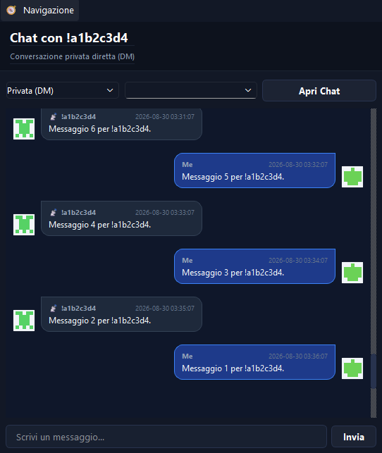
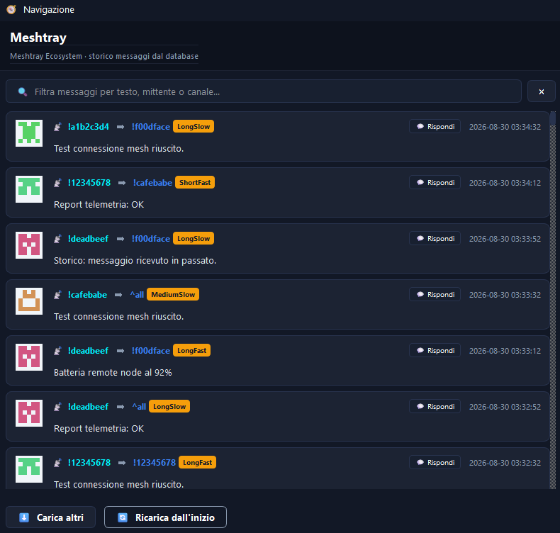

# Guida all'Utilizzo (Meshtray Ecosystem)

Questa guida descrive le funzionalità dell'applicazione e come interagire con il client desktop **Meshtray** e il server di traduzione.

---

## 🚀 Avvio Rapido

All'avvio del client `Meshtray` (tramite script di lancio o eseguibile compilato):

1. **Splash Screen Overlay**: Verrà visualizzato a schermo un banner grafico di caricamento (`starting_banner.png`) per 2.5 secondi, senza bordi o finestre di sistema.
2. **Tray Icon**: L'applicazione si riduce a icona direttamente nel vassoio di sistema (System Tray vicino all'orologio) con un'icona personalizzata (`tray-icon.png`).
3. **Taskbar**: L'applicazione non occupa spazio nella barra delle applicazioni principale (Taskbar) mentre è ridotta a icona, garantendo discrezione.
4. **Istanza Singola**: Un sistema di lock file (`QLockFile`) impedisce di aprire due copie dell'applicazione contemporaneamente. Se ne esiste già una in esecuzione, viene mostrato un avviso e la nuova istanza si chiude.

---

## 🎛️ Barra dei Menu e Navigazione Centralizzata

Ogni finestra del client contiene una barra dei menu superiore (`QMenuBar`) che consente di navigare facilmente tra le diverse sezioni del programma senza dover usare per forza la Tray Icon:

* **Menu App**: Consente di passare a **Ultimi Messaggi** (`Ctrl+L`), **Archivio Messaggi** (`Ctrl+A`), **Chat / Invia** (`Ctrl+C`) o di **Uscire** dal programma.
* **Menu Aiuto**: Fornisce informazioni e scorciatoie utili.

---

## 💬 Finestra "Ultimi Messaggi"

Mostra i messaggi più recenti ricevuti in tempo reale tramite lo stream WebSocket principale del server.

* **Layout a schede (Card Layout)**: I messaggi vengono mostrati come schede scure moderne. Ogni scheda include:
  * **Avatar Identicon**: Un pattern geometrico simmetrico colorato (in stile Gitea/GitHub) generato in memoria dall'hash SHA-256 dell'ID del nodo mittente. Ogni nodo ha sempre lo stesso avatar univoco.
  * Il mittente e il destinatario (es. `nodeA ➔ nodeB`).
  * Badge del canale di appartenenza (cliccabile per aprire direttamente la chat di quel canale).
  * Il testo completo del messaggio con a capo automatico.
  * La data e l'ora locale (convertite automaticamente dal fuso orario del server).
  * Pulsante **Rispondi** (`💬`) per aprire istantaneamente la finestra di chat precompilando l'interlocutore.
* **Isolamento del Loopback**: I messaggi inviati localmente da te vengono visualizzati direttamente nella finestra di chat (`ChatWindow`) e non inquinano la bacheca dei *Messaggi Ricevuti* in questa schermata.
* **Auto-scorrimento**: La finestra scorre automaticamente verso il basso all'arrivo di nuovi messaggi.
* **Sidebar Destra**: Mostra in tempo reale l'elenco dei **Nodi Attivi** (conosciuti nel NodeDB fisico della radio) e dei **Canali Rilevati** (i canali attivi configurati sulla radio). Cliccando su un elemento della lista viene aperta la chat dedicata.


---

## ✉️ Finestra "Chat / Invia" (ChatWindow)

Questa finestra implementa la funzionalità di messaggistica bidirezionale (inclusa la trasmissione radio outbound).

* **Interfaccia a Bolle con Avatar**: Ogni bolla di testo mostra l'avatar identicon del mittente:
  * **Messaggi ricevuti (incoming)**: bolla grigio scuro con avatar dell'interlocutore a sinistra.
  * **Messaggi inviati (outgoing)**: bolla blu scuro con il tuo avatar a destra.
* **Selettore Destinatario/Canale**: Consente di passare istantaneamente tra conversazioni private dirette (DM) con nodi specifici o messaggi broadcast sui canali attivi configurati sulla radio.
* **Pulsante "Carica messaggi precedenti"**: Posizionato in cima alla chat, consente di caricare in background i messaggi storici precedenti salvati nel database per quella specifica conversazione.
* **Input Testo**: Area inferiore dove scrivere il messaggio da trasmettere via radio LoRa. Premendo `Invio` o cliccando sull'icona di invio, il messaggio viene trasmesso via seriale tramite il dispositivo Meshtastic.

> [!NOTE]
> Il server tronca automaticamente i messaggi che superano il **limite fisico LoRa di 228 byte** (codifica UTF-8) prima dell'invio, per evitare errori. Un avviso viene stampato nella console del server.



---

## 📂 Finestra "Archivio Messaggi"

Consente di consultare l'intero storico dei messaggi registrati nel database locale di SQLite tramite il server.

* **Filtro di ricerca integrato**: Una barra di ricerca in tempo reale consente di filtrare le schede storiche per testo, mittente o canale.
* **Pulsante "Carica altri"**: Carica fluidamente i messaggi precedenti dal DB a blocchi di 200 messaggi alla volta.
* **Interattività completa**: Anche i messaggi all'interno dell'archivio storico supportano il click sul pulsante **Rispondi** o sul badge del canale per saltare istantaneamente alla chat.
* **Avatar Identicon**: Come nella finestra "Ultimi Messaggi", ogni scheda storica mostra l'avatar geometrico del mittente.



---

## 🔔 Notifiche Desktop Interattive

All'arrivo di un messaggio, se la finestra principale di Meshtray non è attiva o è chiusa nel vassoio di sistema:

* Viene mostrata una notifica a comparsa (balloon tip / toast) vicino all'orologio di sistema.
* **Icona personalizzata**: La notifica mostra l'**avatar identicon univoco** del nodo mittente (o del canale, per broadcast) come icona, generato dinamicamente in memoria.
* **Cliccando sulla notifica**, il client massimizzerà automaticamente l'interfaccia e aprirà la `ChatWindow` sintonizzandosi sulla corretta conversazione (privata o di canale) da cui proviene il messaggio.
* **Nome applicazione** nelle notifiche:
  * **Windows**: `Meshtastic.Meshtray.Ecosystem` (AppUserModelID registrato).
  * **Linux**: `Meshtray` / `Meshtray Ecosystem` (via DBus standard).

---

## 📊 Badge di Stato della Connessione & Radio

Nell'angolo superiore destro dell'header di ciascuna finestra è presente un badge colorato che indica lo stato combinato del WebSocket e dell'hardware radio in tempo reale:

| Badge | Colore | Significato |
|---|---|---|
| `● LIVE · 📻 RADIO ONLINE` | 🟢 Verde | Server WebSocket connesso e modulo radio USB attivo e rilevato. |
| `● LIVE · 📻 RADIO OFFLINE` | 🟡 Giallo | Server WebSocket connesso, ma nessuna radio USB collegata o radio spenta. |
| `● MOCK` | 🔵 Blu | Modalità simulazione locale attiva (`--mock`). |
| `● DISCONNESSO` | 🔴 Rosso | Connessione al server WebSocket persa o server spento. |

La voce corrispondente nel menu della Tray Icon viene aggiornata in modo coerente.

---

## 🤖 Simulatore Conversazionale (Mock Mode)

Se desideri provare l'interfaccia grafica senza avviare il server reale o senza disporre di una radio fisica:

1. Avvia l'applicazione passando il parametro `--mock` da terminale o tramite gli script di lancio del client:
   ```powershell
   python main.py --mock --delay 3
   ```
2. Il badge nell'header mostrerà **`● MOCK`** in blu per distinguerlo chiaramente dalla modalità live.
3. In questa modalità, il client genera messaggi casuali in background diretti a te.
4. **Auto-Reply**: Quando invii un messaggio in modalità mock, il simulatore attenderà tra 1.5 e 3.0 secondi per poi generare una risposta automatica realistica (es: *"Ricevuto forte e chiaro!"*, *"RSSI: -85dBm"*) proveniente dal nodo o dal canale a cui ti sei rivolto.

---

## 🔗 Connessione Seriale Permanente & Rilevamento Hot-Plug

Il server gestisce la connessione con la radio fisica collegata via USB in modo moderno e robusto:

* **Connessione Permanente**: Una volta aperta, la connessione seriale rimane attiva in modo stabile e continuo per tutta la durata della sessione. Questo previene inutili cicli di disconnessione e riconnessione e azzera i log fastidiosi su terminale e sul display della radio.
* **Monitoraggio Hot-Plug & Push Real-Time**: Un monitor in background controlla lo stato della porta fisica ogni 2 secondi.
  * **Se stacchi la radio**: Il server chiude pulitamente l'handle e invia all'istante una notifica push via WebSocket. La GUI commuta subito lo stato in `● LIVE · 📻 RADIO OFFLINE` e svuota le liste senza mostrare canali fittizi.
  * **Se riattacchi la radio**: Il server si riconnette automaticamente all'hardware, risincronizza il NodeDB e i canali e notifica il client, che aggiorna istantaneamente il badge a `● LIVE · 📻 RADIO ONLINE` e ripopola la sidebar.

---

## 📡 Debug del Firmware Radio locale

Se riscontri anomalie di trasmissione radio LoRa o NAK di sicurezza (es. errore NAK 39 per chiavi pubbliche PKI mancanti a livello firmware), puoi visualizzare lo stream di debug nativo del chip hardware direttamente sulla console del server:

1. Avvia lo script del server passando il flag `--device-debug`:
   ```bash
   ./launch.sh --device-debug
   ```
2. Questo attiverà il passaggio di `debugOut=sys.stdout` all'inizializzazione seriale di Meshtastic, stampando i log interni del dispositivo in tempo reale sulla console del server.
